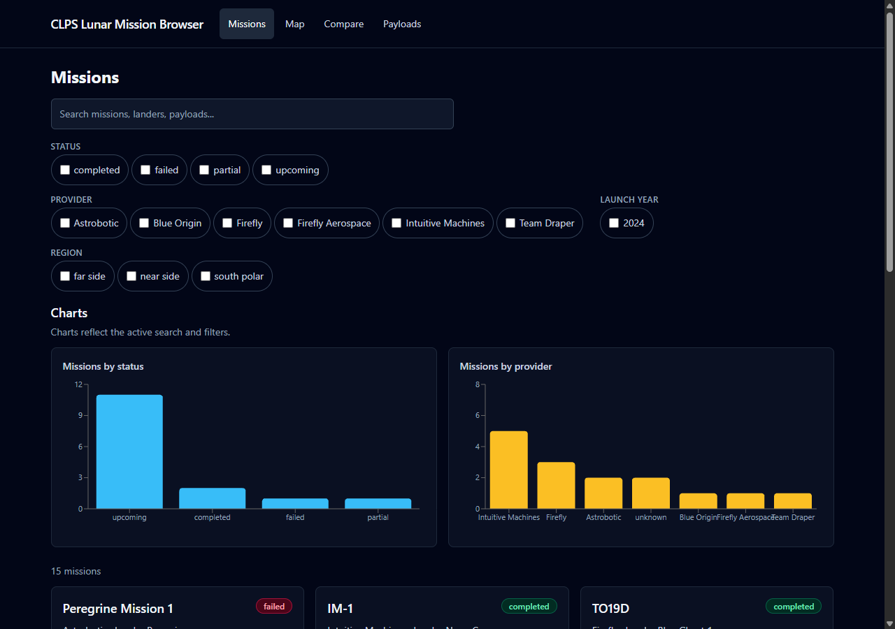
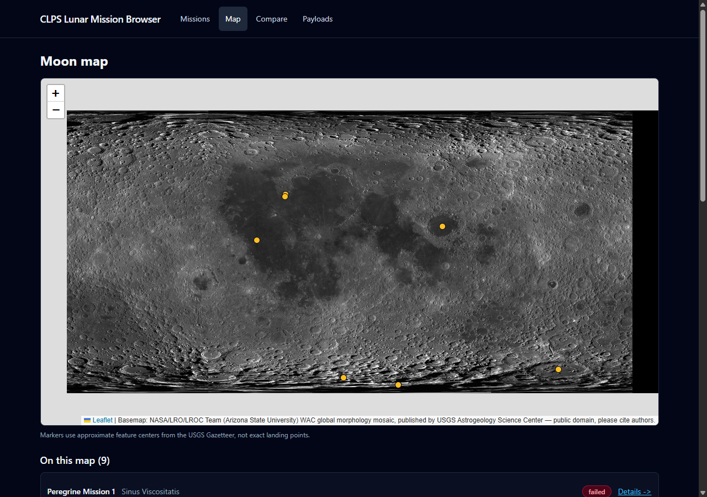
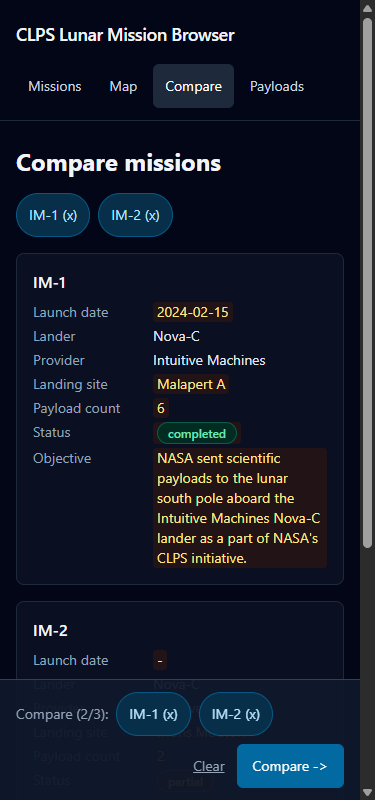

# CLPS Lunar Mission Browser

Explore and compare NASA **CLPS** (Commercial Lunar Payload Services) lunar missions: every
delivery, its lander and provider, landing site on an interactive Moon map, payloads, status,
and sources — built as a static React app over verified NASA/USGS data.

> Independent educational project for NASA Space Apps Challenge 2026 (Bangladesh).
> Not affiliated with or endorsed by NASA.

**Live:** https://clps-agent-kit.vercel.app

## Screenshots

| Mission list | Moon map | Compare (mobile) |
|---|---|---|
|  |  |  |

## Features

- **Mission list** with free-text search (name, lander, provider, site, payloads) and filters
  (status, provider, launch year, region) — AND across filters, OR within one
- **Mission detail** at `/mission/:id`: full record, payloads, objective, outcome, notes,
  and every fact linked to its source
- **Moon map**: NASA LRO WAC tiles (Trek, `L.CRS.EPSG4326`), one marker per mission with
  coordinates; missions without coordinates are honestly listed as "no landing site data"
- **Compare** 2–3 missions side by side (stacked cards on mobile) with differing fields shaded
- **Payload explorer**: browse payloads and see which missions carried them
- **Charts** by status and provider that respond to the active filters
- **Shareable URLs**: search, filters, compare set and map selection all live in the query string

## Setup

```bash
npm install
npm run dev        # local dev server
npm run build      # production build (tsc --noEmit && vite build)
npm run preview    # serve the production build
npm run lint       # ESLint
npm run typecheck  # TypeScript strict
npm test           # Vitest (data validation + pure-function tests)
```

Note for this machine: the shell sets `NODE_ENV=production`, which makes npm skip
devDependencies. Clear it first — bash: `unset NODE_ENV` · cmd.exe: `set "NODE_ENV="` ·
PowerShell: `$env:NODE_ENV=$null`. Then run npm as usual.

## Stack

Vite + React 18 + TypeScript (strict) + Tailwind CSS · react-leaflet + Leaflet (Moon map,
lazy-loaded chunk) · Recharts (charts, lazy-loaded chunk) · Vitest · `react-router-dom`.
Static site: all data bundled as `src/data/missions.json`, no backend.

## Data and sources

15 CLPS deliveries, 50 payload entries (47 distinct names). Every record carries `sources`
and `lastVerified`; unknown values are `null`, never guesses. Full source table:
[`docs/DATA_SOURCES.md`](docs/DATA_SOURCES.md); open gaps and source conflicts:
[`docs/DATA_GAPS.md`](docs/DATA_GAPS.md); schema: [`docs/DATA_SCHEMA.md`](docs/DATA_SCHEMA.md).

- **Mission data**: NASA Science, "CLPS Deliveries" and its per-delivery pages (science.nasa.gov)
- **Coordinates**: USGS Gazetteer of Planetary Nomenclature (planetarynames.wr.usgs.gov) —
  feature centers, so all map positions are flagged approximate
- **Basemap**: NASA/LRO/LROC Team (Arizona State University) WAC global morphology mosaic,
  published by USGS Astrogeology Science Center — public domain, please cite authors

## Credits

Basemap: NASA/LRO/LROC Team (Arizona State University) WAC global morphology mosaic,
published by USGS Astrogeology Science Center — public domain, please cite authors.
Mission data: NASA Science, "CLPS Deliveries" (science.nasa.gov).
Lander details: mission provider pages (Astrobotic, Intuitive Machines, Firefly, …).

## License

- **Data and imagery**: NASA content is generally not subject to copyright in the United States
  for non-commercial use (NASA media guidelines); the WAC mosaic is public domain with a
  "please cite authors" request (USGS Astrogeology record). Attribution is displayed in the app
  footer. Tile-service terms are still unconfirmed and tracked in `docs/DATA_GAPS.md`.
- **Code**: no license file yet — MIT proposed, to be confirmed before submission.

## Measured performance (Lighthouse, production build, 2026-09-29)

| Page | Performance | Accessibility | Best Practices |
|---|---|---|---|
| Home | 99 | 100 | 100 |
| Map | 87 | 96 | 96 |

Targets (NFR-3) are 85 / 90 / 90 — both pages beat them. Map-page limits come from external
NASA tile loading and Leaflet's generated controls.

## Repository layout

```
src/            app (pages, components, lib pure functions, data/missions.json)
docs/           requirements, schema, sources, gaps, decisions, wireframes, pitch
plans/          phase plans (A prep … H ship)
tasks/          pending / running / completed — the work log (see docs/WORKFLOW.md)
scripts/        status.sh — live task counts
```
